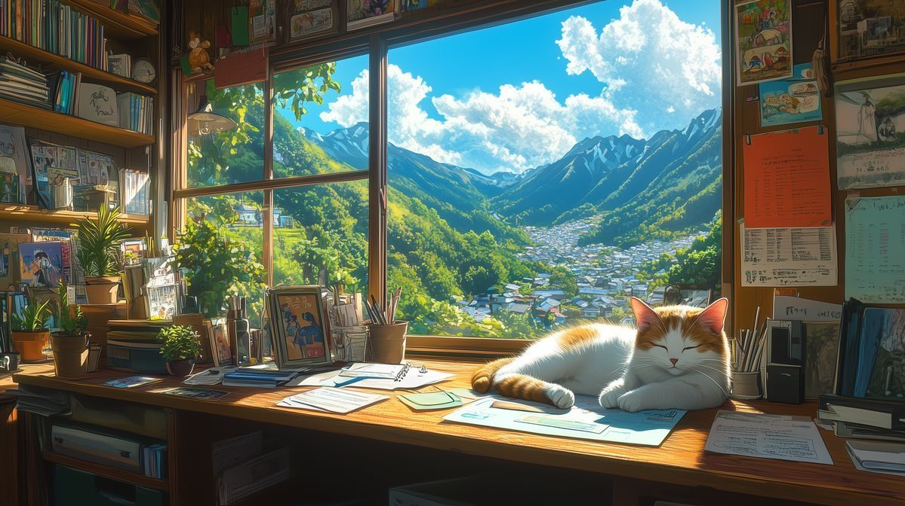

  

<h1 align="center">
  Hi, I'm <b>Nguyen Nhi</b> 👋
</h1>

  <i>Though I am ordinary among many. 
  I am still the one and only in this world!</i>

---

## 🔧 My Stack  

  

---

## 📊 GitHub Languages  

  

---

## ✨ Fun Touch  

  

---

## 🌍 Connect with me  

  
  
  

